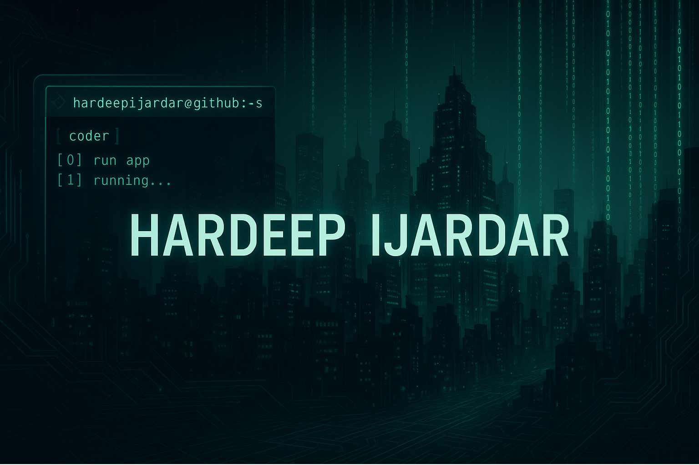

# 👋 Hi there, I'm Hardeep Ijardar

Aspiring Full-Stack Developer | Problem Solver | Tech Enthusiast  
🎓 B.Tech in Information Technology @ Parul University  
🌐 [Portfolio](http://hardeepijardar.com/) | 📫 hardeepijardar@gmail.com | 📱 +91 9328231035

---

## 🔗 Connect with Me

---

## 🛠️ Tech Stack

### 👨‍💻 Languages

### 🌐 Front-End

### 🔧 Back-End & Tools

### 🗄️ Databases

### ☁️ Hosting & Deployment

---

## 🚀 Projects

- 🌐 [**Personal Portfolio Website**](http://hardeepijardar.com)  
  Built with HTML, CSS, JavaScript. Includes blog, GitHub links, responsive layout, and showcases multiple projects.

- 🥗 **NutriPal** – Nutrition recommendation site  
  Built during PU Code Hackathon. Features personalized diet plans based on BMI and preferences.

- 📱 **Android Apps**  
  Developed with Java and Kotlin using Android Studio. Integrated with Firebase and RESTful APIs.

---

## 🏆 Achievements & Certifications

- **Deloitte Data Analytics Job Simulation** - April 2025  
  Completed real-world tasks involving data forensics and analytics via Forage.

- **Android Application Development** - March 2024  
  Java, Kotlin, Firebase, REST API integration, debugging & UI/UX design.

- **PU Code Hackathon – NutriPal** - March 2024  
  Personalized diet planner using web dev + API logic.

- **Web Development Certificate** - May 2023  
  React, Express, Node, TailwindCSS, Bootstrap-based project work.

---

## 📈 GitHub Stats

---

## ✍️ Blog Contributions

- [Blog on What is Internet?](https://hardeepijardar.hashnode.dev/what-is-internet)
- [Blog on Revolution of AI](https://revolution-of-artificial-intelligence.hashnode.dev/the-ai-revolution-transforming-the-present-shaping-the-future-1)
- [Blog on Creating API-endpoint using BUN](https://how-to-create-api-endpoint-using-bun.hashnode.dev/how-to-create-api-endpoints-in-bun)

---

Thanks for visiting my profile! Let’s connect and build something amazing 🚀
